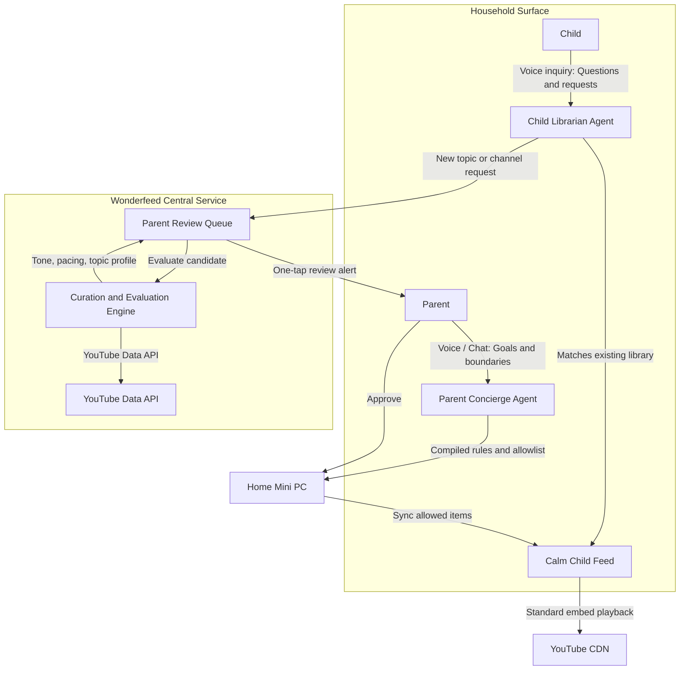

# Wonderfeed architecture

## Current shape

Wonderfeed is a **host repository** with provider submodules. A host Go CLI runs the pinned YT Zero provider locally and also serves a parent **control plane** (`wonderfeed control serve`) that owns child policy in host PostgreSQL and syncs a supported subset through a YT Zero adapter.

```text
Parent device (authenticated HTTP)
  -> Wonderfeed control plane (internal/controlplane + internal/httpapi)
    -> host-owned wonderfeed.* tables in PostgreSQL
    -> provider.ChildProfileProvider adapter (policy + profiles via YT Zero HTTP)
    -> provider.AllowlistSynchronizer (experimental direct writes to YT Zero tables in shared PostgreSQL)
    -> provider-owned feed state and playback links
```

## Target product flow (vision)

Not implemented yet. Parent concierge and child librarian agents, plus a central curation service, sit on top of the home host. Detail: [curated-library.md](curated-library.md) and the root [README](../README.md).



## Ownership boundary

| Concern | Owner today | Notes |
| --- | --- | --- |
| Product principles, roadmap, parent UX intent | Wonderfeed host | Docs and host skills under this repo |
| Local provider run (compose, process-compose, env, health) | Wonderfeed host | `deploy/ytzero/`, `data/postgres/`, `data/ytzero/`, `cmd/wonderfeed` |
| Parent child-policy and allowlist control plane | Wonderfeed host | `wonderfeed control serve`; schema `wonderfeed.*`; adapter under `internal/provider/ytzero` |
| Subscription inbox, tags, rules, profiles | YT Zero provider | Source at `providers/ytzero`; DB in host Postgres; files under `data/ytzero` |
| Remote HTTPS to homes (school/product) | Wonderfeed + Cloudflare | Design in [cloudflare.md](cloudflare.md); not local serve |
| Device lockdown / kiosk / DNS blocks | Outside app (OS, browser profile, network) | Required for real child enforcement |
| YouTube embed chrome and related videos | YouTube platform | Not fully removable via embed params |
| Premium / ad-free entitlement | Signed-in YouTube session in the playback browser | Separate from Wonderfeed curation |

**Rule:** do not write Wonderfeed brand, private paths, or family policy into `providers/ytzero`. Prefer host adapters and docs. See `.cursor/rules/repository-boundaries.mdc`.

## Layers (conceptual)

### 1. Curation and feed state

Trusted channels, tags, automatic rules, archive/reject flows, and chronological inbox behavior. Wonderfeed owns the parent-approved allowlist in PostgreSQL as provider-scoped entries (`youtube` first) and syncs membership into the selected YT Zero child profile through an experimental host-side PostgreSQL writer. YT Zero still implements the resulting subscription inbox and playback without Google login or YouTube Data API keys. The roadmap is YouTube-first, not YouTube-only: future providers plug into the same control-plane API and curation rules.

### 2. Parent approval and policy

Who may watch what, daily limits, Shorts/live gating, request-to-approve flows, and diversity rules (for example max one video per channel in N slots). Wonderfeed now owns desired child policy in host tables and syncs supported fields (`daily_minutes`, `local_only`, `hide_shorts`, `hide_live`, `downloads_only`) to YT Zero. Approval queues and main-feed diversity remain host work ahead.

### 3. Child presentation

The surface children actually use. Options deliberately deferred:

- Use YT Zero UI directly in a locked browser profile.
- Wrap YT Zero behind a thinner Wonderfeed child UI.
- Consume provider APIs/data and render a separate host UI.

### 4. Playback

Video bytes and player chrome remain with YouTube (embed) or optional local download plugins inside the provider. Wonderfeed must treat playback entitlement (cookies, Premium family seats) as a browser-session concern, not as something a custom proxy can honestly invent.

### 5. Device and network enforcement

The real boundary against "open youtube.com and escape the feed." Managed child profiles, kiosk mode, app allowlists, and DNS filtering sit here. Application design can reduce escape hatches; it cannot replace OS-level controls.

## Integration seams (likely)

These are the places a future host adapter will touch first:

1. **Channel set import/export** — OPML, Takeout CSV, NewPipe JSON already understood by YT Zero.
2. **Feed listing** — chronological uploads from allowlisted channels, with format filters.
3. **Triage states** — watch / schedule / archive / reject as durable host or provider state.
4. **Profile and limit APIs** — Wonderfeed `ChildProfileProvider` maps host policy onto provider profiles (YT Zero `/api/profiles` today).
5. **Allowlist API** — parent-only CRUD at `/api/v1/parent/children/{id}/allowlist` and `/allowlist/{provider}/{external_id}`; host sync writes YT Zero `user_channels` rows in the shared PostgreSQL database (no provider source changes required).
6. **Playback handoff** — approved `videoId` into an embed or provider player, never unrestricted search.

Host control-plane persistence lives in PostgreSQL schema `wonderfeed` (migrations embedded under `internal/controlplane/store/migrations/`). Provider ops remain documented in [operator-ytzero.md](operator-ytzero.md). Start the API with `wonderfeed control serve` (loopback by default; non-loopback requires `WONDERFEED_PARENT_AUTH_KEY`).

## Explicit limitations

- Embedded YouTube players can still expose platform UI (logo, related content behavior, fullscreen). Policy must assume partial escape unless the device blocks it.
- Privacy-enhanced (`youtube-nocookie`) embeds conflict with reliable Premium session recognition. Prefer ordinary `youtube.com` embeds when Premium is required.
- Third-party frontends that avoid Google login generally cannot inherit YouTube Premium entitlements.
- YT Zero is a strong foundation for "manage your own algorithm," not a complete substitute for OS lockdown.
- Allowlist sync is experimental and schema-coupled: it requires the household PostgreSQL DSN used by both Wonderfeed and YT Zero (`DATABASE_URL`). Policy patches may still use `YTZERO_SESSION_COOKIE` when HTTP auth is enabled.
- Preventing a child from widening the allowlist inside the provider UI remains
  a separate enforcement problem (permissions, child lock, and future host UI).

## Deferred decisions

Documented in [roadmap.md](roadmap.md): wrap vs extend vs replace YT Zero UI, runtime language, auth model, telemetry policy, and ranking sophistication beyond rules.

A longer-horizon hosted **curated library** (YouTube Data API discovery, sampled evaluation, shared “stuff that matters” catalog) is sketched in [curated-library.md](curated-library.md). It is not part of the home Postgres / provider ops slice.
