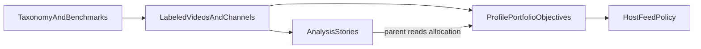

# Content portfolio (vision)

**Status:** draft product direction. Not scheduled. Not implemented. Does not change Milestone 1 home Postgres / YT Zero ops or the current control-plane MVP.

Wonderfeed’s near-term path stays allowlist-first on the household mini computer. This note captures a longer-horizon idea: parents steer what children watch not only through buttons and limits, but through **labeled content**, **allocation stories**, and **portfolio-style feed objectives** within the approved library.

## Problem

A chronological list of video titles does not help most parents. They often do not recognize individual uploads, and raw watch logs do not answer questions like “was this week too much passive entertainment?” or “did we hit the learning mix we wanted on school nights?”

Button-only policy (Shorts off, time limits, allowlist) sets guardrails but does not express **developmental goals** or **target mixes** across kinds of content. Parents need summaries they can act on, then a way to bias the internal feed recommender per profile, time of day, and day of week, including from **written objectives** rather than only toggles.

## Metaphor: portfolio, not diary

Think of the allowlist as the **investable universe**: only approved channels and videos can appear in the child feed. Within that universe, each child profile holds a **content portfolio**: target allocations across taxonomy dimensions (for example more STEM on weekday mornings, more calm storytelling on Sunday evening).

Parents set **targets** and **benchmarks** (household or suggested baselines). Watch time and feed composition roll up into **analysis stories** (“this week: 40% entertainment vs 25% target”) rather than an opaque title dump. Adjustments look like **rebalancing**: change weights, schedules, or natural-language objectives; the host compiles those into feed policy. Objectives that would widen the allowlist or bypass fail-closed playback are rejected.

This is parent-owned algorithm design in the product-brief sense: explicit rules and goals, not a black-box engagement model.

## Layers

| Layer | Role |
| --- | --- |
| Taxonomy and benchmarks | Versioned Wonderfeed-owned dimensions and reference targets (not YouTube’s ranker) |
| Labeled videos and channels | Each allowlisted item carries taxonomy tags (and optional scores) for analysis and ranking |
| Analysis stories | Parent-facing narratives over labeled watch and non-watch aggregates |
| Profile portfolio objectives | Per-profile weights, schedules, and compiled feed objectives within the allowlist |
| Host feed policy | Order, diversity, format gates, and session limits applied on the home host |

## Taxonomy sketch (illustrative)

Not a final schema. Dimensions might include:

| Dimension | Examples (illustrative) |
| --- | --- |
| Topic family | STEM, arts, sports, social skills, general knowledge |
| Format | Long-form, Shorts, live, series vs one-off |
| Pacing / attention load | Calm, moderate, high stimulation (Wonderfeed judgment) |
| Age band | Fit for profile age or household band |
| Maker type | Educator, creator, brand channel, mixed |

Labels are **Wonderfeed product data**. YouTube API topic or category fields may inform labeling where policy allows, but displayed scores and suitability language stay clearly ours (see [curated-library.md](curated-library.md) compliance summary and [legal/youtube-api/](legal/youtube-api/README.md)). Taxonomy does not certify that a video is “safe”; allowlist and parent approval still gate play.

## Benchmarks

Benchmarks give stories a reference line: household-specific targets, or suggested defaults parents can adopt. Stories compare **actual allocation** (minutes or slot share by taxonomy) to **target allocation** over a window (day, week). Rejects and skipped items can appear in aggregates when labeled (“attempted Shorts while gated”) without replacing the portfolio frame.

## Analysis stories

Stories are the parent-facing output parents actually read:

- Mix vs target by taxonomy dimension
- Trends by day of week or time of day
- Notable shifts after a portfolio or objective change

They are not a substitute for the hosted library’s candidacy review ([curated-library.md](curated-library.md)) and not a live session remote (YT Zero’s child activity panel remains provider-side for “watching now” stop/unlock).

## Portfolio controls (later)

Vision capabilities, not shipped:

- **Target weights** per taxonomy dimension per child profile
- **Schedule slices** (weekday morning vs weekend afternoon) with different target mixes
- **Feed objectives** in natural language, compiled by a parent concierge into weights and constraints
- **Fail-closed compile**: objectives cannot add channels, open search, or weaken format gates without explicit parent approval paths

Ranking sophistication beyond simple rules is explicitly deferred in [architecture.md](architecture.md); this vision describes *what* parents optimize, not engagement cloning of YouTube Home.

## Boundaries and non-goals

- Does not replace allowlist-first or fail-closed playback for children.
- Does not mirror YouTube Home, For You, or Shorts shelves as the product.
- Does not claim taxonomy or benchmarks equal child safety certification.
- Does not require a raw “parent activity view” (title chronology) on the host; superseded by labeled stories and portfolio controls when built.
- Does not put Wonderfeed brand or household fixtures into `providers/ytzero`.
- Training a large open-web video safety classifier as MVP remains a [product-brief](product-brief.md) non-goal; start with metadata, policy-safe text signals, human review, and household labels.

## Relation to existing docs

| Doc | Relationship |
| --- | --- |
| [curated-library.md](curated-library.md) | **Candidacy:** does this channel/video belong in the shared library? Evaluation and discovery. |
| [content-portfolio.md](content-portfolio.md) | **Allocation:** within the household allowlist, what mix and stories, and how to bias the feed? |
| [product-brief.md](product-brief.md) | Parent owns the algorithm; vocabulary for taxonomy and portfolio |
| [architecture.md](architecture.md) | Feed policy and approval layers; device lockdown still separate |
| [roadmap.md](roadmap.md) | Near-term milestones unchanged; this is later direction |
| [legal/youtube-api/](legal/youtube-api/README.md) | API metadata refresh and “not from YouTube” disclosure for scores |

## Open questions (before an ADR)

- Who authors and versions the taxonomy (ops, parents, both)?
- Where labeling runs: home mini PC only, hosted service, or hybrid?
- Privacy and retention for household watch aggregates and story exports?
- How portfolio objectives interact with main-feed diversity rules (for example max one channel per N slots)?
- When to record an ADR and schedule implementation relative to curated library and control-plane maturity?

When those are decided, record an ADR under `docs/decisions/` and only then schedule implementation.
