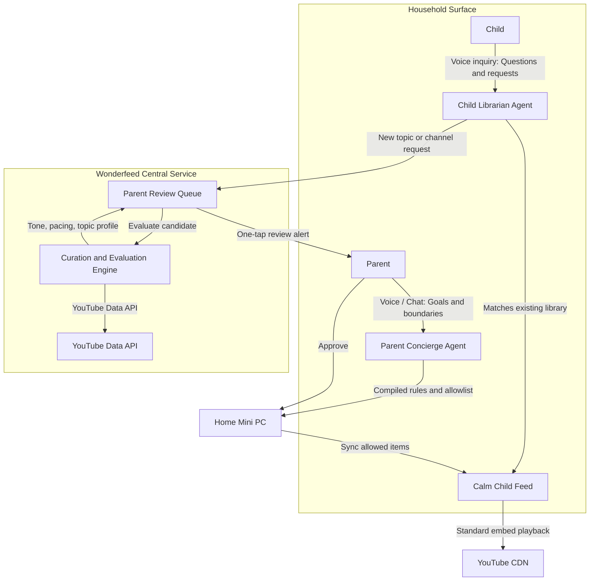

# Hosted curated library (vision)

**Status:** draft product direction. Not scheduled. Not implemented. Does not change Milestone 1 home Postgres / YT Zero ops.

Wonderfeed’s near-term path stays allowlist-first on the household mini computer. This note captures a longer-horizon idea: grow a **library of content that matters**, not content that only captures attention, and drive discovery from that library instead of YouTube Home.

## Problem

YT Zero and the home host know subscribed channels and household policy. They do not invent a shared, values-aligned catalog of “what is good to follow.” Raw YouTube search and recommendations optimize for engagement. Parents still need a way to **discover** channels worth adding, and kids who search need a **review path** that inspects candidates without opening the stock YouTube feed.

## Product shape

A **hosted curation service** (Wonderfeed-operated, separate from each home mini PC) owns:

1. YouTube Data API credentials and quota (one carefully managed Google Cloud project; no quota sharding).
2. A growing curated database of channel/video **ids**, Wonderfeed judgments, and **refreshed** API metadata.
3. Evaluation pipelines that sample candidates and decide whether something belongs in the library.
4. Search and suggestion APIs that homes and parent UIs call.

Each **home** still owns:

- Household allowlist and session policy (fail-closed).
- Local provider state (profiles, subscriptions, YT Zero playlists and inbox metadata).
- Playback via embeds (parent Premium browser session) and device lockdown.

Kid inquiry never means “play whatever YouTube returns.” It means “ask the librarian / parent path,” with fail-closed defaults. Same diagram lives in the root [README](../README.md) and [architecture.md](architecture.md).

### Home proactive agent (optional later)

A proactive agent on the mini PC can help **household** work: re-check channels already on the allowlist, local triage, suggest from the hosted library, optional local transcripts of content the family already chose. It should **not** hold the shared YouTube API key or burn `search.list` quota on every home. Discovery against YouTube stays on the hosted service; homes consume the curated catalog.

## Two different rails: home inbox vs Data API catalog

| Rail | How data arrives | Where it lives | Storage rule of thumb |
| --- | --- | --- | --- |
| YT Zero / home Postgres | Public RSS-style ingestion (no Data API key today) | Household mini PC | Durable household inbox (titles, thumbs, playlists in provider DB) |
| Hosted curated library | Official YouTube Data API v3 | Wonderfeed central service | API-sourced fields: delete or **refresh within ~30 days**; Wonderfeed verdicts are product data |

YT Zero already stores titles and other metadata locally. That does **not** mean a Data API shadow catalog can keep unrefrushed API JSON forever. Different acquisition path, different policy bucket. See [legal/youtube-api/](legal/youtube-api/README.md).

**Playlists:** YT Zero “your playlists” / followed playlists are **provider-local** collections. A playlist created *on YouTube* (user account) is YouTube’s storage, not an API response cache. Neither replaces the need to refresh API metadata the hosted service displays from Data API responses.

## What YouTube Data API supplies

Public catalog cards and coarse signals, via a Google Cloud **API key** (not the parent’s Premium browser cookies):

| Capability | Endpoint (sketch) | Use |
| --- | --- | --- |
| Find channels / videos by text | `search.list` | Parent discovery; seed kid-search candidates |
| Channel card | `channels.list` | Title, description, stats, uploads playlist |
| Video card | `videos.list` | Title, description, tags, duration, `madeForKids`, ratings, topics, embeddable |
| Cheap channel sampling | `playlistItems.list` on uploads | Pick a few recent videos without burning search quota |

### Pricing and quota

YouTube does not bill per call like a typical cloud meter. Default free daily quotas (see quota doc in the legal tracker):

- **`search.list`:** about **100 calls/day** in its own bucket (scarce).
- **`videos.insert`:** separate upload bucket (not our path).
- **Everything else** (`videos.list`, `channels.list`, `playlistItems.list`, …): shared **10,000 units/day**, usually **1 unit** per cheap list call.

Quota resets at midnight Pacific Time. Exceeding or circumventing limits (including spreading one use case across many projects) is disallowed. Prefer id-based list calls after search.

### API search is not youtube.com search

`search.list` is a developer search (query + filters + a simpler relevance model). It is **not** the same as logged-in youtube.com / app search (personalization, shelves, experiments). Good enough to discover candidates for a curated library; do not expect pixel-parity with a Premium phone search.

The API does **not** expose personalized Home, For You, Watch Next, or Shorts feeds.

## Evaluation loop (channel candidacy)

When someone searches or nominates a channel, the service can:

1. Resolve the channel via API (`search` / `forHandle` / `id`).
2. Pull a small sample of recent uploads (uploads playlist; cheap list calls).
3. Fetch metadata (`videos.list`: `snippet`, `status`, `contentDetails`, `topicDetails`).
4. Obtain text signals only via **policy-safe** paths (for example captions the API permits). Do **not** download or cache audiovisual content / separate audio for ASR without YouTube’s prior written approval.
5. Score against Wonderfeed criteria (age fit, topic fit, attention-bait signals, household or global policy).
6. Write a durable record: Wonderfeed accept / reject / hold for human review (labeled as **Wonderfeed’s** judgment, not YouTube’s).
7. Surface results to the parent as “suggested follows,” not as autoplay for the child.
8. Keep API-sourced display fields fresh: background job re-fetches active ids on a ≤30-day cadence (or drops stale API payloads).

Over time, family approvals and rejects enrich a **shared** catalog so later households start from better priors. Household allowlists remain sovereign; the shared DB is a suggestion and labeling layer, not a forced subscription.

## Recommendations without YouTube Home

“Recommendations” in this model means:

- Similar channels already judged good in the curated DB.
- New uploads from channels the household already trusts (home provider job today).
- Parent-facing “you might add” candidates from global/library judgments.

It does **not** mean mirroring YouTube’s engagement ranker inside Wonderfeed.

## Compliance and product constraints (summary)

Not legal advice. Authoritative text and hashes: [legal/youtube-api/](legal/youtube-api/README.md). Refresh with `make youtube-api-terms-refresh`.

| Topic | Practical takeaway |
| --- | --- |
| API metadata storage | Most public API data: delete or refresh within ~30 days; keep ids + Wonderfeed verdicts; re-fetch titles/stats for display |
| Derived metrics | Do not replace YouTube stats with homemade equivalents; disclose Wonderfeed scores as not from YouTube |
| “Safe / suitable” claims | Developer Policies Guide warns against using the API to claim a video/channel is safe or suitable to watch; Wonderfeed verdicts stay clearly ours + parent-gated |
| Scraping | No scraping youtube.com / apps; Data API only for this service |
| Audiovisual download | No download/cache of AV or separated audio without prior written approval |
| Embeds | Standard YouTube player; do not strip ads/related chrome in banned ways; check Made for Kids before embed |
| Child-directed clients | COPPA/GDPR-style duties; notify Google; limits on write actions from kid surfaces |
| Substitute YouTube | Must add significant independent value; do not clone Home/browse as the product |
| Playback entitlement | Parent Premium (or family) session in the locked browser; unrelated to the API key |

## Boundaries and non-goals (for this vision)

- Does not replace home Postgres or YT Zero for household feed state.
- Does not put YouTube API keys on every mini PC by default (central service holds them).
- Does not scrape or replay children’s Google logins; Premium remains the playback browser session.
- Does not claim transcript or scoring equals full safety; parents and policy still gate play.
- Does not treat API search as identical to youtube.com search.
- Training a large open-web video safety classifier as MVP remains a product-brief non-goal; start with metadata + policy-safe text signals + human review, then grow the DB.

## Relation to existing docs

| Doc | Relationship |
| --- | --- |
| [product-brief.md](product-brief.md) | Parent owns the algorithm; allowlist first; push fresh trusted content |
| [architecture.md](architecture.md) | Layers: curation vs playback vs device lockdown stay separate |
| [cloudflare.md](cloudflare.md) | Homes stay sovereign; a central plane can exist for provisioning/catalog without publishing Postgres |
| [roadmap.md](roadmap.md) | Near-term milestones stay provider trial and control-plane MVP; this is later |
| [legal/youtube-api/](legal/youtube-api/README.md) | Official API terms URLs, hashes, refresh verb |

## Open questions (before an ADR)

- Who may write to the shared library (ops only, parents, both)?
- Global catalog vs per-school / per-tenant partitions?
- Exact captions / text-signal pipeline that stays inside Developer Policies (no AV download)?
- How homes authenticate to the hosted service without Cloudflare Access for every child?
- Whether a home agent is in scope for v1 of this vision or only the hosted path?
- Compliance audit / quota-extension timing before multi-tenant launch?

When those are decided, record an ADR under `docs/decisions/` and only then schedule implementation.
